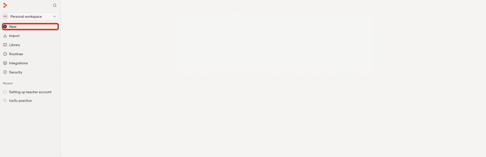
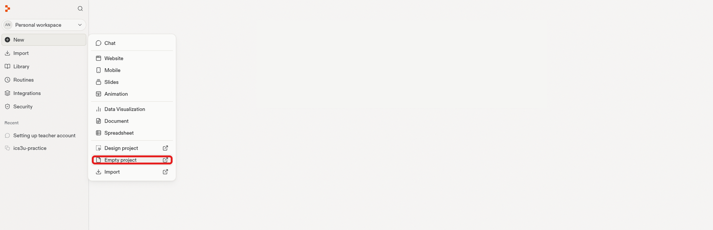
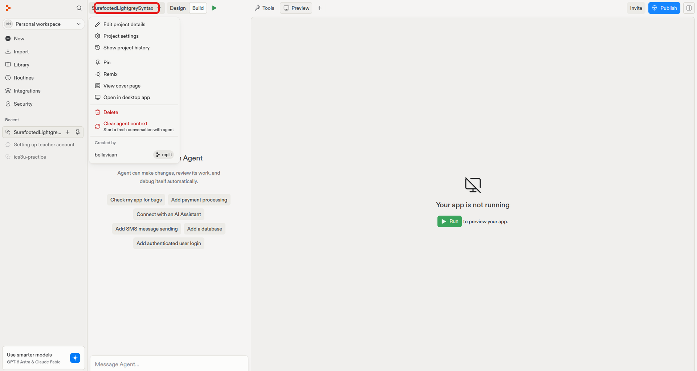
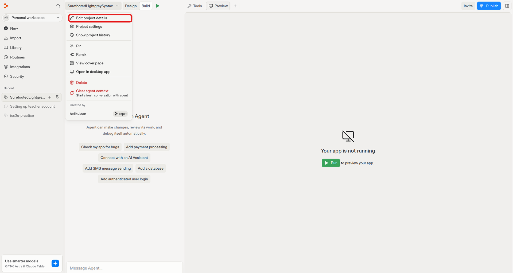
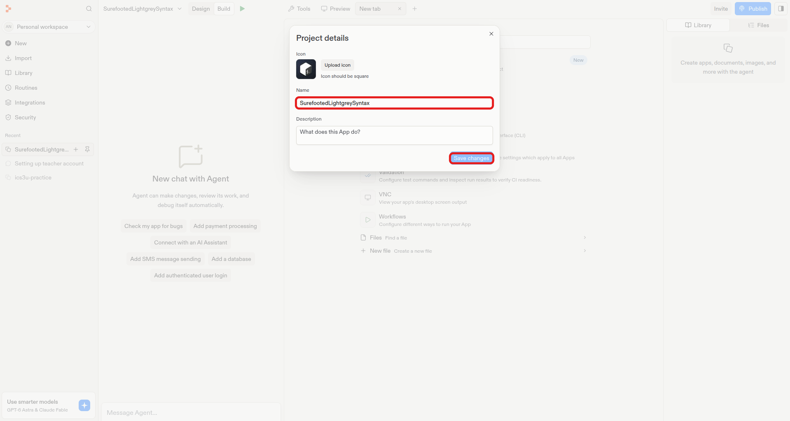
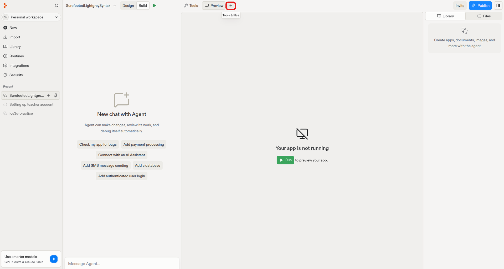
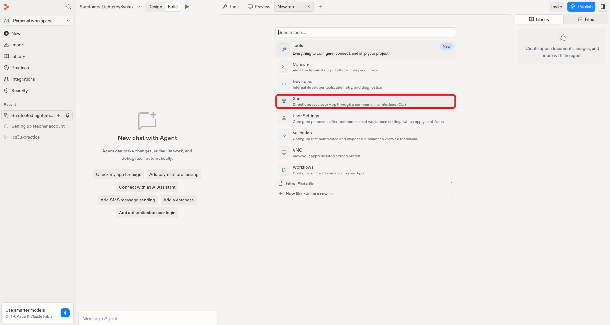
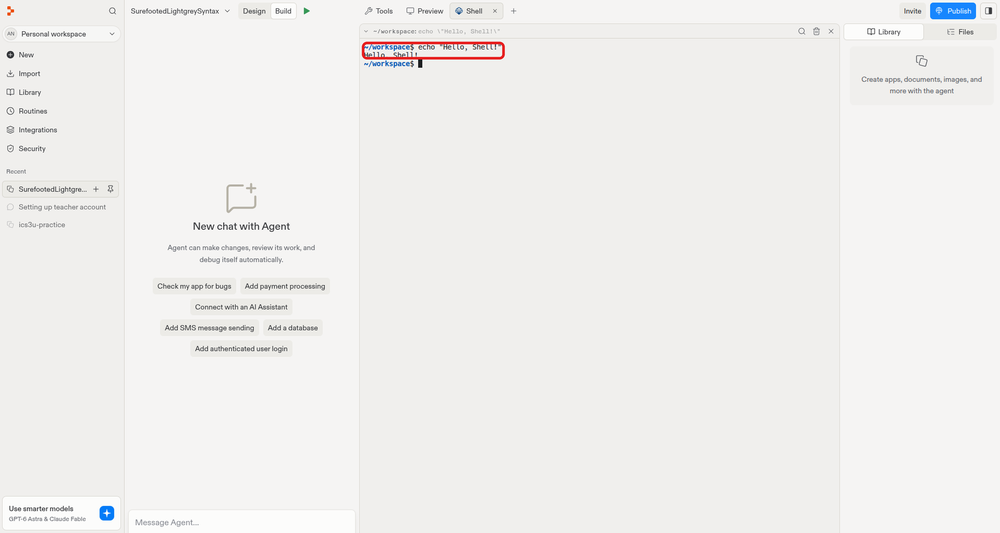
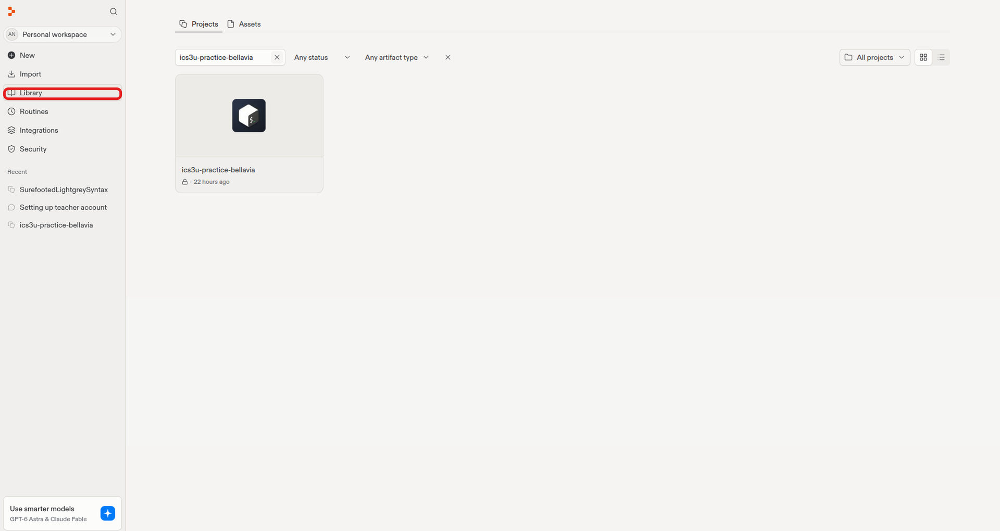
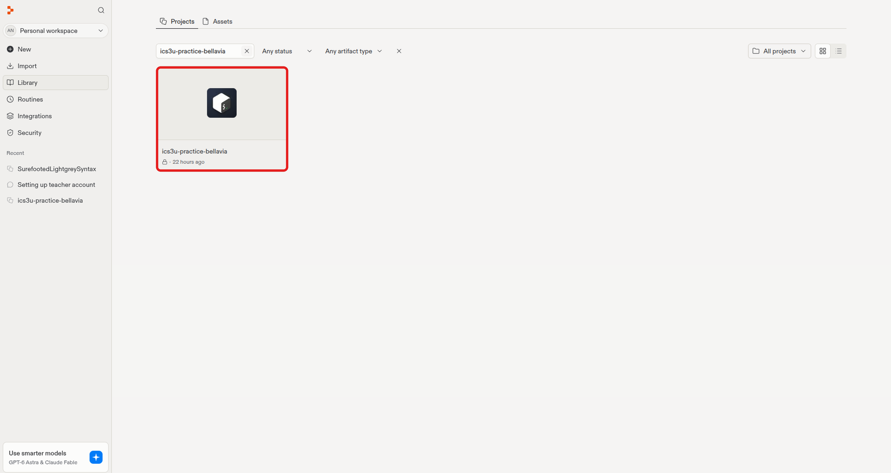

# Lesson 2: Setting Up Replit

**Previous:** [← Lesson 1: From ICS3U to ICS4U](1-intro.md)

We'll use [Replit](https://replit.com){: target="_blank" } to write and run code throughout
this course.


!!! note "What is Replit?"
    Replit is a website that lets you write, run, and share code entirely
    in your browser — no installation required.

## Where Does Replit Fit In?

Replit isn't running code on your own laptop's hardware — it's running
your project on remote servers (computers owned and managed by
Replit), and streaming the result back to your browser. This is why
Replit works the same whether you're on a school Chromebook, a laptop,
or a phone: the heavy lifting happens elsewhere, not on your device.

## Create Your Account

1. Go to [Replit Sign Up](https://replit.com/?authModal=signup){: target="_blank" }
2. Click **Sign up** and create a free account using your school email
   (e.g. `yourname@hwcdsb.ca`), not a personal email
3. Verify your email if prompted

## Create Your First Project

**Step 1.** On your Replit dashboard, hover over **New** in the sidebar

{: width="700" style="display:block;margin:0 auto;border:1px solid #ccc;border-radius:8px;" }

**Step 2.** In the menu that appears, click **Empty project** — Replit
auto-generates a project name

{: width="700" style="display:block;margin:0 auto;border:1px solid #ccc;border-radius:8px;" }

!!! note "Pop-up about credits?"
    {: width="400" }

    If a pop-up appears asking you to upgrade or "Keep using Replit,"
    just click the **X** in the top-right corner to close it. You don't
    need to upgrade or pay for anything in this course.

**Step 3.** Click your project name (top-left) to open its menu

{: width="700" style="display:block;margin:0 auto;border:1px solid #ccc;border-radius:8px;" }

**Step 4.** Select **Edit project details** to rename it to include your
own name — for example `ics4u-practice-firstname-lastname`

{: width="700" style="display:block;margin:0 auto;border:1px solid #ccc;border-radius:8px;" }

**Step 5.** In the **Name** field, clear the auto-generated name and
type a name that includes your own name, such as
`ics4u-practice-firstname-lastname`, then click **Save changes**

!!! note "Why include your name?"
    Naming your project with your own name makes it easy for your
    teacher to identify whose work is whose when reviewing or grading
    projects.

{: width="700" style="display:block;margin:0 auto;border:1px solid #ccc;border-radius:8px;" }

## Using the Shell

The **Shell** is a command-line terminal built into your Replit project.
This is where you'll run your programs and check what version of tools
you have installed.

**Step 1.** Open your project, then click the **+** button next to the
**Preview** tab to open a new tab

{: width="700" style="display:block;margin:0 auto;border:1px solid #ccc;border-radius:8px;" }

**Step 2.** In the list that appears, click **Shell**

{: width="700" style="display:block;margin:0 auto;border:1px solid #ccc;border-radius:8px;" }

A terminal pane will open, ready for commands. Once open, the Shell
stays available as its own tab — you can switch back to it any time
without repeating the steps above. It only closes if you click the
**X** on the tab yourself.

Try typing this into the Shell and pressing Enter:

```bash
echo "Hello, Shell!"
```

You should see `Hello, Shell!` printed back at you. Congratulations —
you've just run your first command!

{: width="700" style="display:block;margin:0 auto;border:1px solid #ccc;border-radius:8px;" }

## Getting Back to Your Projects

**Step 1.** From your Replit dashboard, click **Library** in the sidebar

{: width="700" style="display:block;margin:0 auto;border:1px solid #ccc;border-radius:8px;" }

This shows the full list of every project you've created.

{: width="700" style="display:block;margin:0 auto;border:1px solid #ccc;border-radius:8px;" }

From this page you can open, rename, or organize any project you've
created.

!!! abstract "Keywords"
    - **Replit** — a browser-based platform for writing and running
      code
    - **Repl / Project** — a single coding workspace within Replit
    - **Shell** — a command-line terminal for typing text commands
    - **Command** — a single instruction typed into the Shell

---

**Next:** [Lesson 3: Creating a TypeScript Project →](3-organizing-projects.md)
<!-- **Next:** Lesson 3: (available soon) -->
