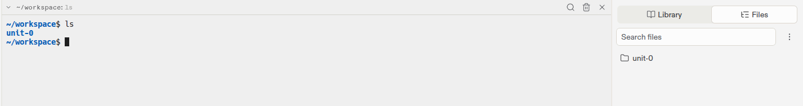
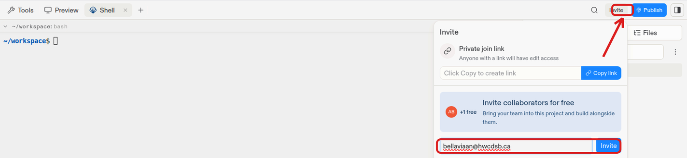
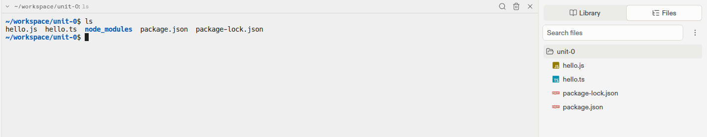

# Assignment 1

**Previous:** [← Lesson 3: Creating a TypeScript Project](3-organizing-projects.md)

## Part 1: Write and Run Your Program

*Knowledge — 4 marks*

**Step 1.** Create a new Replit project named `ics4u-firstname-lastname`
(using your own name) — see [Setting Up Replit](2-setting-up-replit.md)
for the steps to create and name a new project.

**Step 2.** Create a folder for this unit's work:

```bash
mkdir unit-0
```

`mkdir` creates a new folder — in this case one called `unit-0`.

**Step 3.** Check that it was created:

```bash
ls
```

`ls` (short for "list") shows every file and folder in your current
location. You should see `unit-0` listed.

{: width="700" style="display:block;margin:0 auto;border:1px solid #ccc;border-radius:8px;" }

In this example, `ls` shows the newly created folder on its own line —
that's the folder you just made with `mkdir`.

**Step 4.** Move into that folder:

```bash
cd unit-0
```

`cd` ("change directory") moves you into the `unit-0` folder, so any
files you create next will be organized inside it.

**Step 5.** Following the same steps from
[Setting Up Replit](2-setting-up-replit.md) (installing TypeScript,
creating a file, writing code, and compiling/running it), create a new
TypeScript file named:

```
u0-a1.ts
```

!!! note "Naming convention"
    `u0-a1` = Unit 0, Assignment 1. You'll use this same `uN-aN`
    pattern for future assignment files.

Write a program in `u0-a1.ts` that prints **your name** to the
console, then compile and run it to confirm it works.

For example, if your name is Alex:

```typescript
console.log("Alex");
```

**Step 6.** Invite your teacher to your project so your work can be
reviewed and marked (see the note below for how), then confirm your
`console.log` output is visible in the Shell.

!!! note "How to invite your teacher"
    Click **Invite** (top-right), type your teacher's email address in
    the box, and click **Invite**.

    {: width="700" style="display:block;margin:0 auto;border:1px solid #ccc;border-radius:8px;" }

## Part 2: Practice Navigating Folders

*Application — 4 marks*

This part is for practice, but does require its own submission.

**Step 1.** In the Shell, list the contents of your current folder:

```bash
ls
```

You should see `u0-a1.ts`, `u0-a1.js`, and the other files created
when you installed TypeScript. Notice your Shell prompt also shows
`unit-0`, confirming you're inside that folder.

{: width="700" style="display:block;margin:0 auto;border:1px solid #ccc;border-radius:8px;" }

*Example above uses `hello.ts`/`hello.js` — your own files will be
named `u0-a1.ts` and `u0-a1.js` instead.*

!!! note "Files not showing in the panel on the right?"
    Click on the **unit-0** folder name in the Files panel to expand
    it — the individual files only appear once the folder is opened.

**Step 2.** Move back up one folder:

```bash
cd ..
```

`cd ..` moves you up one level — out of `unit-0` and back into your
project's main folder.

**Step 3.** List the contents again:

```bash
ls
```

Compare this to what you saw in Step 1 — you should now see the
`unit-0` folder itself listed, instead of the files inside it. This
confirms you've moved back up successfully.

!!! note "Shell getting cluttered?"
    If your Shell has a lot of old commands and output on screen, type
    `clear` and press Enter to wipe it and start with a clean view.

**Step 4.** Confirm your teacher has been invited to this project (see
Step 6 in Part 1) so your `ls` output from Step 3 can be reviewed.

---

**Next:** [Lesson 4: Basic TypeScript Syntax →](4-syntax-basics.md)
