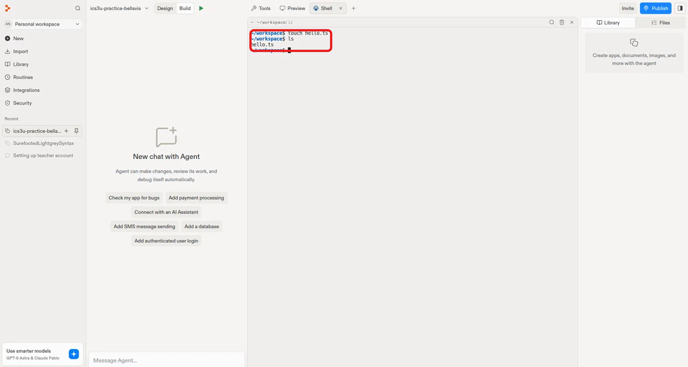
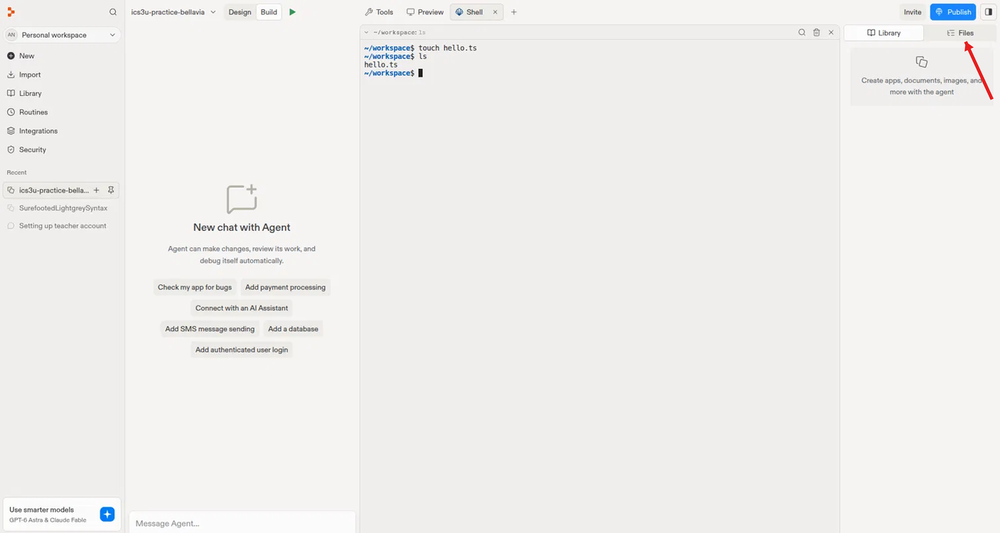
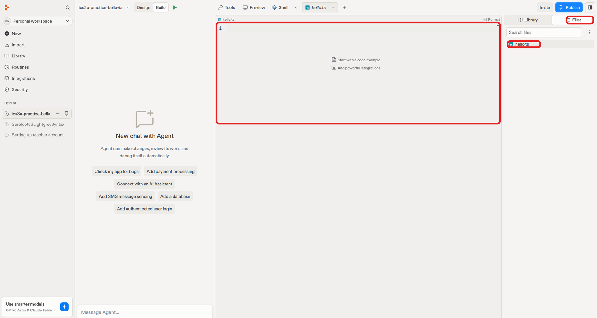
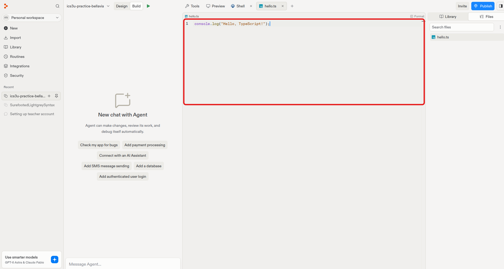
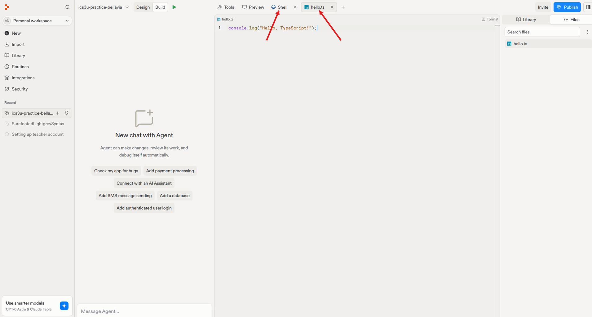
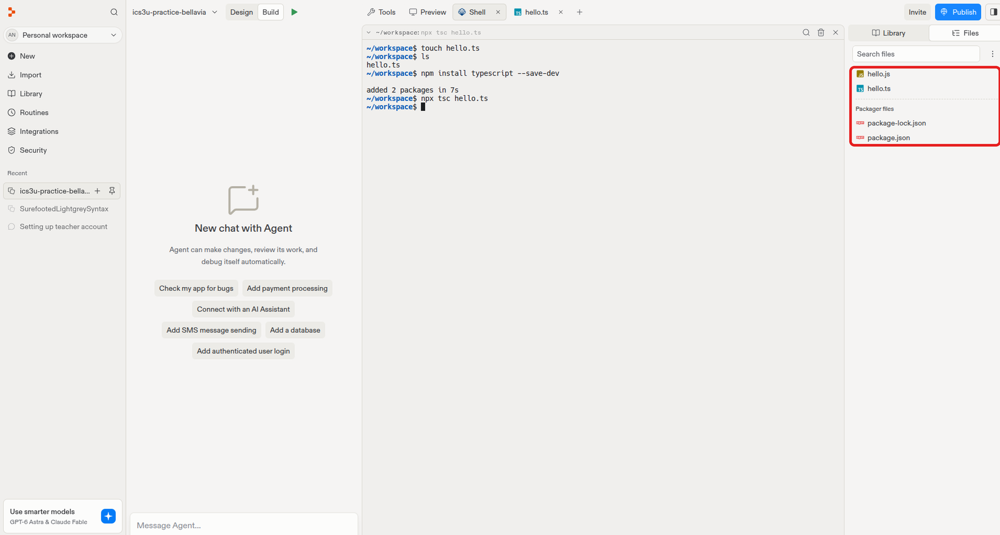
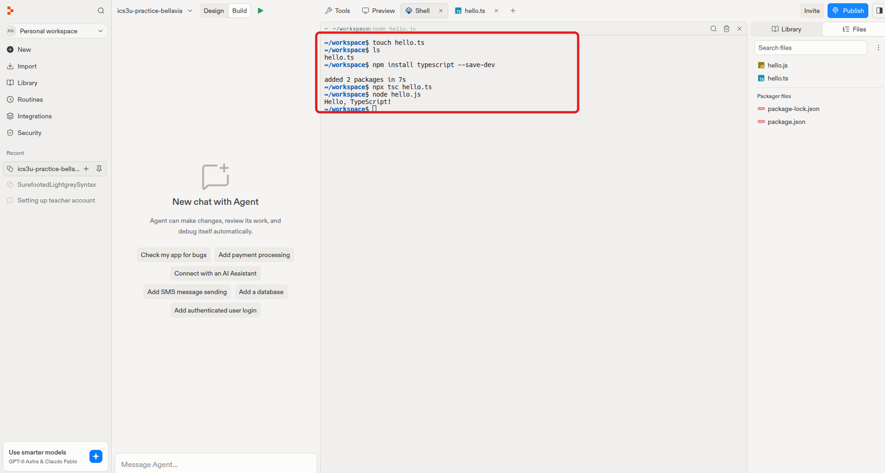
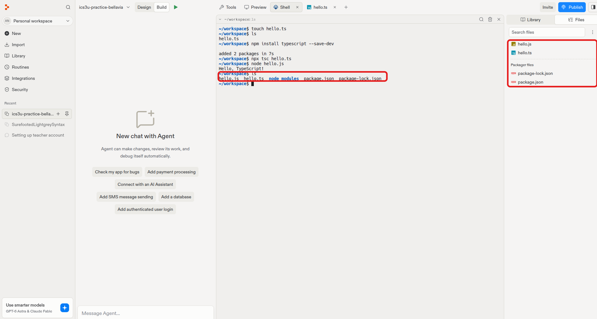

# Lesson 3: Creating a TypeScript Project

**Previous:** [← Setting Up Replit](2-setting-up-replit.md)

In this lesson you'll create, write, compile, and run your first
TypeScript file.

## Creating and Opening a File

You can also create new files directly from the Shell instead of using
the Files panel. Try typing this into the Shell:

```bash
touch hello.ts
```

`touch` creates a new, empty file — in this case one called `hello.ts`.

!!! note "What is a `.ts` file?"
    `.ts` is the file extension for **TypeScript**, the programming
    language we're using throughout this course. TypeScript is built on
    top of JavaScript — one of the most widely used languages in the
    world, especially for building websites and apps — but adds extra
    structure that helps catch mistakes *before* your code even runs.

    Learning to code in TypeScript means everything you write (`.ts`
    files) gets translated into plain JavaScript before it actually
    runs, which is why you'll always see a **compile step** (`tsc`)
    before a **run step** (`node`) in this course.

You can confirm the file was created by typing:

```bash
ls
```

`ls` (short for "list") shows every file in your current folder. You
should see `hello.ts` listed.

{: width="700" style="display:block;margin:0 auto;border:1px solid #ccc;border-radius:8px;" }

**To open the file and start coding:**

**Step 1.** Click the panel toggle icon in the top-right corner to open
the side panel, then click the **Files** tab (next to Library) — this
shows every file in your project

{: width="700" style="display:block;margin:0 auto;border:1px solid #ccc;border-radius:8px;" }

**Step 2.** Click `hello.ts` from that list — it opens in the code
editor, ready for you to type

{: width="700" style="display:block;margin:0 auto;border:1px solid #ccc;border-radius:8px;" }

Write your code in the editor. For example:

```typescript
console.log("Hello, TypeScript!");
```

{: width="700" style="display:block;margin:0 auto;border:1px solid #ccc;border-radius:8px;" }

!!! note "Do I need to save?"
    No — Replit saves your file automatically as you type. There's no
    save button to click and no keyboard shortcut to remember; just
    write your code and move on.

Once you're editing, the **Shell** tab stays open in the background —
click back to it any time to compile and run your file.

{: width="700" style="display:block;margin:0 auto;border:1px solid #ccc;border-radius:8px;" }

Keep an eye on which tab is active — the highlighted tab (with a darker
background) is the one currently shown below it. Click **Shell** to
type commands, or click **hello.ts** to go back to editing your code.
You can switch back and forth as often as you like; nothing you've
typed is lost when you switch tabs.

**Step 1.** Install TypeScript in your project (only needs to be done
once per project):

```bash
npm install typescript --save-dev
```

**Step 2.** Compile your file into plain JavaScript:

```bash
npx tsc hello.ts
```

Take a look at the **Files** panel on the right after running these two
commands. Running `npm install` adds **`package.json`** and
**`package-lock.json`** — files that keep track of which packages your
project depends on (you'll see these under "Packager files"). Then
compiling with `npx tsc hello.ts` adds **`hello.js`** — the plain
JavaScript version of your code that was just created alongside
`hello.ts`.

{: width="700" style="display:block;margin:0 auto;border:1px solid #ccc;border-radius:8px;" }

**Step 3.** Run the compiled file:

```bash
node hello.js
```

- `npx tsc hello.ts` — runs the TypeScript compiler on your file. It
  checks your code for type errors, then converts `hello.ts` into a
  plain JavaScript file called `hello.js`. Node can't run TypeScript
  directly, so this translation step is required.
- `node hello.js` — runs the compiled JavaScript file, actually
  executing your code and printing the output to the Shell.

In short: **compile, then run** — two separate steps, since TypeScript
never runs directly; it always gets converted to JavaScript first.

You should see `Hello, TypeScript!` printed in the Shell — your code
compiled and ran successfully.

{: width="700" style="display:block;margin:0 auto;border:1px solid #ccc;border-radius:8px;" }

## Checking Your Work

Now that you've compiled and run your file, run `ls` again in the
Shell:

```bash
ls
```

You should notice a few new things compared to before:

- **`hello.js`** — the compiled JavaScript file created by `npx tsc`
- **`node_modules`** — a folder created by `npm install`, containing
  the TypeScript compiler itself
- **`package.json`** and **`package-lock.json`** — files that keep
  track of which packages your project depends on

You can also check this two different ways at once: the **Shell**
output on the left, and the **Files** panel on the right, side by side.
Both should show the exact same set of files — a good habit to build,
since it confirms your commands actually did what you expected.

{: width="700" style="display:block;margin:0 auto;border:1px solid #ccc;border-radius:8px;" }

!!! note "Tidying up the Shell"
    After running a bunch of commands, your Shell can get cluttered with
    old output. Typing:

    ```bash
    clear
    ```

    wipes everything currently shown in the Shell and gives you a fresh,
    empty prompt. It doesn't undo anything or delete any files — it just
    clears the *display* so it's easier to read. Your command history is
    still there; you can still press the up arrow to bring back previous
    commands even after clearing.

!!! abstract "Keywords"
    - **`touch`** — creates a new, empty file
    - **`ls`** — lists files and folders in the current location
    - **`.ts` file** — a TypeScript source code file
    - **Compile** — translating code into a form the computer can run
      (`npx tsc`)
    - **`.js` file** — the plain JavaScript file produced by compiling
    - **`npm install`** — downloads and installs a package (like
      TypeScript itself)
    - **`node_modules`** — a folder holding installed packages
    - **`package.json`** — a file tracking which packages a project
      depends on
    - **`clear`** — clears the Shell's display without affecting files

---

**Next:** [Assignment →](4-assignment-2.md)
