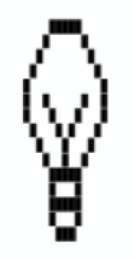

# Exercise 1: Hello World & Output

**Previous:** [← Hello World & Output (Review)](1-hello-world-output.md)

## Question 1

Create a new file named `u1-e01-1.ts`. Output each of the following to
the console **exactly as shown**:

**a)**
```
Hello World!
I am a computer program!
```

**b)**
```
7 + 3 = 10
five plus six is 11
10 * 10 = 100, Goodbye!
```

## Question 2: ASCII Art

Create a new file named `u1-e01-2.ts`. Using a combination of the
block character `█` and spaces, recreate a simple image of your
choosing — try your own initials, or a simple shape.

!!! note "Have fun with it"
    There's no single correct answer here. Try designing your image on
    a grid of squares on paper first, then convert each row into a
    `console.log()` statement.

**Example:** a light bulb, built the same way — using `█` for the "on"
squares and spaces everywhere else:

{: width="276" style="display:block;margin:0 auto;image-rendering:pixelated;" }

---

**Next:** [Data Types, Variables, & Errors (Review) →](2-data-types-variables-errors.md)
